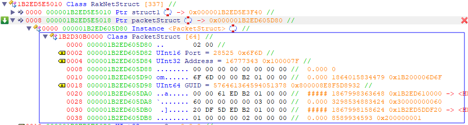
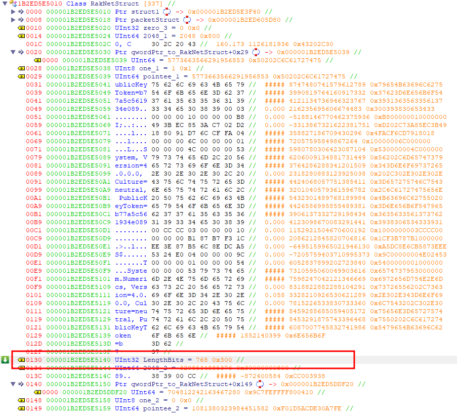
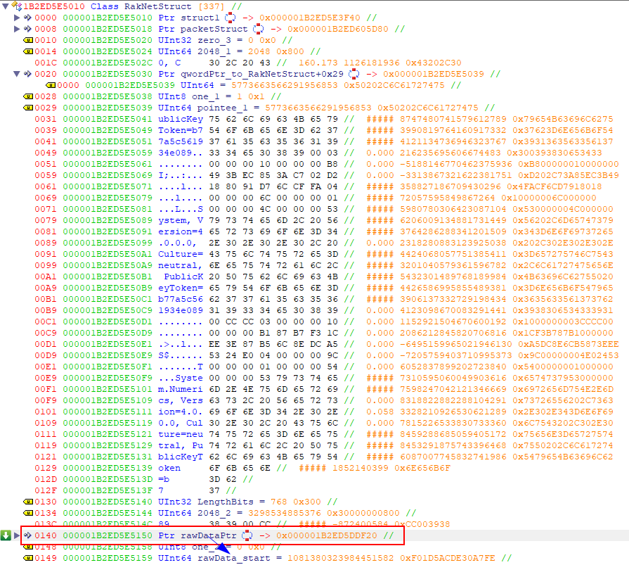
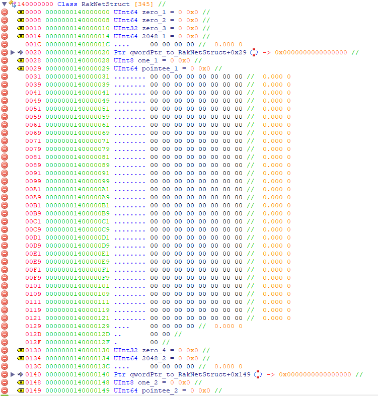

[[Home]](../../README.md)  
[[Back]](./Index.md)

# About
RakNet is the C++ library Facepunch uses for network communication to/from the client/server. However the RakNet version used in the game (client) as well in the server is heavily modified since RakNet is open-source.  
RakNet is the "legacy" method of networking, the newer method is SteamNetworking but as of writing this, that method is rarely used, its only used if you enable it manually with a launch option.

# Overview
## Exported DLL functions
* `NETRCV_Address`
* `NETRCV_GUID`
* `NETRCV_LengthBits`
* `NETRCV_Port`
* `NETRCV_RawData`
* `NETRCV_ReadBytes`
* `NETRCV_SetReadPointer`
* `NETRCV_UnreadBits`
* `NETSND_Broadcast`
* `NETSND_ReadCompressedFloat`
* `NETSND_ReadCompressedInt32`
* `NETSND_ReadCompressedInt64`
* `NETSND_Send`
* `NETSND_Size`
* `NETSND_Start`
* `NETSND_WriteBytes`
* `NETSND_WriteCompressedFloat`
* `NETSND_WriteCompressedInt32`
* `NETSND_WriteCompressedInt64`
* `NET_Close`
* `NET_CloseConnection`
* `NET_Create`
* `NET_GetAddress`
* `NET_GetAveragePing`
* `NET_GetGUID`
* `NET_GetLastPing`
* `NET_GetLowestPing`
* `NET_GetReceiveBufferSize`
* `NET_GetStatistics`
* `NET_GetStatisticsString`
* `NET_LastStartupError`
* `NET_LimitBandwidth`
* `NET_Receive`
* `NET_SendMessage`
* `NET_StartClient`
* `NET_StartServer`

# Function definitions
## NETRCV_Address
**Parameters:** `void* net`  
**Returns:** `uint32_t`  
 
**Description:** Returns `(uint32_t) RakNetStruct+8]+PacketStruct+4]`. I think this is the local address, but in weird format, since its not anything like a normal address. Maybe memory address/offset? Seems its `16777343` for my case.  
*See structure image below*  

## NETRCV_GUID
**Parameters:** `void* net`  
**Returns:** `uint64_t`  
 
**Description:** Returns `(uint64_t) RakNetStruct+8]+PacketStruct+18]`. GUID should be unique per every raknet instance, they might collide across different processes/instances 
*See structure image below*  

## NETRCV_LengthBits
**Parameters:** `void* net`  
**Returns:** `int`  
 
**Description:** Returns `(uint32_t) RakNetStruct+130]`. This is how much bits are received from the last call to NET_Receive()  

## NETRCV_Port
**Parameters:** `void* net`  
**Returns:** `uint32_t`  
 
**Description:** Returns `(uint16_t) RakNetStruct+8]+PacketStruct+2]`. Again this should be the local port, but its not the correct port, its some other port 
*See structure image below*  

## NETRCV_RawData
**Parameters:** `void* net`  
**Returns:** `void*`  
 
**Description:** Returns `(void*) RakNetStruct+140]`. This is a pointer to the data ~~which starts at `RakNetStruct+149` which is at the end of the RakNetStruct~~ (this seems to not be true after a while/the initialization)  

## NETRCV_ReadBytes
**Parameters:** `void* net, void* data, int length`  
**Returns:** `bool`  
 
**Description:** ...

## NETRCV_SetReadPointer
**Parameters:** `void* net, int bitsOffset`  
**Returns:** `void`  
 
**Description:** ...

## NETRCV_UnreadBits
**Parameters:** `void* net`  
**Returns:** `int`  
 
**Description:** `(uint32_t) RakNetStruct+138] - NETRCV_LengthBits()` if this is `== NETRCV_LengthBits()` then just `NETRCV_LengthBits()` is returned

## NETSND_Broadcast
**Parameters:** `void* net, int priority, int reliability, int channel`  
**Returns:** `uint32_t`  
 
**Description:** ...

## NETSND_ReadCompressedFloat
**Parameters:** `void* net`  
**Returns:** `float`  
 
**Description:** ...

## NETSND_ReadCompressedInt32
**Parameters:** `?`  
**Returns:** `?`  
 
**Description:** ...

## NETSND_ReadCompressedInt64
**Parameters:** `?`  
**Returns:** `?`  
 
**Description:** ...

## NETSND_Send
**Parameters:** `void* net, uint64_t connectionID, int priority, int reliability, int channel`  
**Returns:** `uint32_t`  
 
**Description:** ...

## NETSND_Size
**Parameters:** `void* net`  
**Returns:** `uint32_t`  
 
**Description:** ...

## NETSND_Start
**Parameters:** `void* net`  
**Returns:** `void`  
 
**Description:** ...

## NETSND_WriteBytes
**Parameters:** `void* net, void* data, int length`  
**Returns:** `void`  
 
**Description:** ...

## NETSND_WriteCompressed
**Parameters:** `?`  
**Returns:** `?`  
 
**Description:** ...

## NETSND_WriteCompressed
**Parameters:** `?`  
**Returns:** `?`  
 
**Description:** ...

## NETSND_WriteCompressed
**Parameters:** `?`  
**Returns:** `?`  
 
**Description:** ...

## NET_Close
**Parameters:** `void* net`  
**Returns:** `void`  
 
**Description:** ...

## NET_CloseConnection
**Parameters:** `void* net, uint64_t connectionID`  
**Returns:** `void`  
 
**Description:** ...

## NET_Create
**Parameters:** `none`  
**Returns:** `void*` - Ptr to raknetstruct  
 
**Description:** Creates heap allocated block of 0x250 bytes. Some values are initialized to 0, 2048 and 1.  
Image of how the structure looks in ReClass (name of fields are what they are initialized to)  

## NET_GetAddress
**Parameters:** `void* net, uint64_t connectionID`  
**Returns:** `void*`  
 
**Description:** ...

## NET_GetAveragePing
**Parameters:** `void* net, uint64_t connectionID`  
**Returns:** `int`  
 
**Description:** ...

## NET_GetGUID
**Parameters:** `?`  
**Returns:** `?`  
 
**Description:** ...

## NET_GetLastPing
**Parameters:** `void* net, uint64_t connectionID`  
**Returns:** `int`  
 
**Description:** ...

## NET_GetLowestPing
**Parameters:** `void* net, uint64_t connectionID`  
**Returns:** `int`  
 
**Description:** ...

## NET_GetReceiveBufferSize
**Parameters:** `void* net`  
**Returns:** `uint32_t`  
 
**Description:** ...

## NET_GetStatistics
**Parameters:** `void* net, uint64_t connectionID, RaknetStats* data, int dataLength`  
**Returns:** `bool`  
 
**Description:** ...

## NET_GetStatisticsString
**Parameters:** `void* net, uint64_t connectionID`  
**Returns:** `void*`  
 
**Description:** ...

## NET_LastStartupError
**Parameters:** `void* net`  
**Returns:** `void*`  
 
**Description:** ...

## NET_LimitBandwidth
**Parameters:** `?`  
**Returns:** `?`  
 
**Description:** ...

## NET_Receive
**Parameters:** `void* net`  
**Returns:** `bool`  
 
**Description:** ...

## NET_SendMessage
**Parameters:** `void* net, void* data, int length, uint32_t adr, uint16_t port`  
**Returns:** `void`  
 
**Description:** ...

## NET_StartClient
**Parameters:** `void* net, char* hostName, int port, int retries, int retryDelay, int timeout`  
**Returns:** `int`  
 
**Description:** ...

## NET_StartServer
**Parameters:** `void* net, char* ip, int port, int maxConnections`  
**Returns:** `int`  
 
**Description:** Initializes structures and copies ip, port and maxConnections to internal structures 
NOTE: If IP is empty string it seems it binds to 0.0.0.0 which is just binding to any available IP. Usually this will be computer's IP (like: 192.168.0.170)
